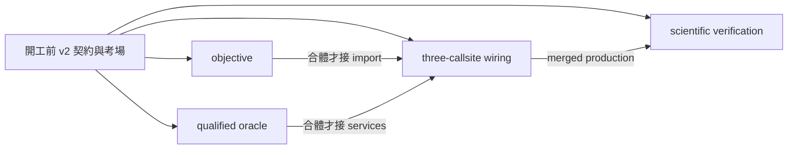

# Learned refine v2 返工提案（只提不裁）

u = flow 生成的 latent 序列，編碼一段想像軌跡；decode 成具體路徑。主案建議 **v2-b：LePlanner 式 generated-plan quality，每個 iterate 監督，paired head exposure，F5 選 EMA**。四模組，主線 inline 是必改接入面。這是呈 lead／主人裁的設計與考場，不是已完成 lacot 修復。只在 proposal-v2 寫檔，CPU 玩具訓練，無 GPU／真訓練／worker 派工。

先讀完 ADVERSARY-SUMMARY、scout2 三份 29 條 survey、v1 五件套與考場後設計。再核對現行唯讀 code：主線在 `experiments/scratch_lacot_rollout.py`，不是 repo 根目錄同名檔；兩 actor 在 `lacot/model.py`。精確 hash、親跑輸出見 EVIDENCE.md。survey 所述論文數字是提供材料，本輪未重新審核論文或重現其實驗。

## 三候選與取捨

| 候選 | 真正的訓練構造 | 有效目標與落地條件 | 本輪建議 |
|---|---|---|---|
| **LePlanner 式** | 當前 flow 真 sample→當前 refine 自己的 iterate，每輪經 frozen decoder 取得 goal/hold/feasibility/support cost，整段反傳 | cost 評本條生成計畫，完全不需要找「它的」資料 action；需 frozen decoder 能讀 flow OOD、geometry/動態 cost 可信、避免只把 proxy 作漂亮 | **主案**。已有 frozen `_dec` 與 GeoEnergy 可重用，最短可救實際 sampler 分布；新增 head same-plan 教師是主要工程前提。不是照抄 LePlanner world model，也不聲稱沒有風險 |
| ReflexFlow 式 anti-drift | 從已知 data endpoint 的 coupled path 做模型 drift，再用「endpoint−drift point」作方向監督；隨著模型更新 refresh 自身 states | **配對 endpoint 不能丟**。LaCoT 是 exact invertible TARFlow，不是 flow-matching diffusion；forward(data)→inverse(noise) 精確 roundtrip 幾乎無 drift，且 inferred base noise 不保證等同當前 Gaussian sampler。需同 noise 強 teacher 或同樣本 optimizer 產 endpoint，並另外覆蓋 raw flow samples | 次案。可當主案的 paired optimizer distillation 輔助；不能用「同 cond」或 nearest random data 冒充 coupling。沒有現成可靠 endpoint teacher，直接移植論文 anti-drift 不成立 |
| DMD 分布級 | student(refine(flow noise)) current samples，加 diffusion noise；fake score online 擬合當前學生分布，與 fixed conditional target score 之差更新 student；每輪輸出也覆蓋 | 不需 pointwise sample/data 配對，但要條件 target score 與 online fake score；reverse KL 有 mode dropping 風險，conditional 支持不足會 proxy exploitation | 保留研究案。額外兩個 score 系統、交替訓練與收斂驗收，blast radius 超過現有幾何路線；不是幾行換 MSE 就能修 |

FQL 的 teacher/student **同一個 noise** 是 coupling 典範；它不是「兩次獨立抽樣在同 cond 就可以 MSE」。同 noise behavioral tether 只保留原 teacher 能力，提升另靠 Q/quality，且 FQL 是 one-step actor，不能據此保證迭代 refine scaling。DMD 的 paired regression 若用，也必須同 noise teacher sampler。

來源依提供 survey：[LePlanner](https://arxiv.org/html/2609.13845)、[ReflexFlow](https://arxiv.org/abs/2512.04904)、[DMD](https://arxiv.org/html/2311.18828v4)、[FQL](https://arxiv.org/html/2502.02538)。選主案與 TARFlow 適用性是本提案推論。

## B1/B2 根治路徑

B1：撤回 v1 的 data±.05 主監督＋保守 identity 正則。新主臂從部署 flow.sample 起步；每次更新都重取 sample，R=1..3 所有自身狀態受有效 J 指導，R0 只 anchor/density。輔助 jitter 也從 flow sample 起步，不能取代零 jitter 主臂。full BPTT 保留；quality 單獨有改善方向，EMA 不能獨任教師。

B2：新 `lacot/refine_training.py::compose` 是唯一 loss 組合點，傳入 features/clean 語意 adapter。**M2 直接替換主線 1720–1734，並改 1779 total**；不能只改 model.py。density 的 `_et_nf`、head 的 `_u_head`、flow.sample 輸出的 u 可屬不同空間，closure 分清，保留 mask/COND_DROP/intent/FSQ 語意。主線不得把新 total 又加一次 anchor/nf。兩 actor 同步用 compose，R0 不要求新 provider。

三份資料流：clean→既有 nf/anchor；flow sample→refine iterates→frozen decoder→plan quality；同條 decoded plan→合格 frozen inverse dynamics→head exposure。後者只訓 head/可訓 cond，不對 refine 回傳自造 action label，refine 的主監督仍是可微 J。將原 Q3 的非資料 latent 可讀性橋補回，且用 no-grad gauge 直接量，不填0。

真碼已凍住 u_dec（1134–1138），但 `s_embed` 也需一起凍住。GeoEnergy 目前在 stage2 之後才建（2485 起），需提前以同 builder 建訓練 provider，保持 eval 語意。decoder 是 xy，不是 action oracle：M4 必建 same-plan action teacher、validity、held-out 校準。先以 pointmaze 範圍落地；ant/影像沒有合格 dynamics 時不能宣稱已救。這個 oracle 驗收是合體前提，不是 worker 排程依賴。

## F5 呈裁，不默改語意

| 裁選 | 實際規則 | 代價／門檻 |
|---|---|---|
| **建議直接採現有 CONS=ema** | student Fθ(u_r) 對 frozen Fema(u_r)，與 scratch:1724–1727 相同；保留 NEVER used alone，quality 持續供主訊號 | R1 在 teacher 滯後時有梯度；同步初始化零梯度合法。保留 EMA 配置、補 skip-step 與 resume；EMA 不構成收斂保證 |
| 原 self-cons + rounds>=2 | 保留早輪追後輪的原式；有 refine 的 training batch 不得 R1，R0 仍合法 | 避免第一輪左側 no-grad 死訊號，但改了原 U{0..3} depth 分布；R1 inference 另外驗。consistency 仍不能單用 |

撤回 v1 `u_next−sg(u_prev)`。不把保守更新重新命名成 consistency。兩方案由 lead／主人裁；本包 EMA 專屬測試在 consistency_test.py，設計無關的 integration_test.py 不規定採哪個公式。

## 模組所有權（基準行號固定，亦附 symbol）

| 模組 | 一句話責任 | 唯一 production 寫入所有權 | 檔位 |
|---|---|---|---|
| M1 mod-objective | generated-plan quality 與 recurrent 梯度 | 新 `lacot/refine_objective.py`，`tests/test_refine_objective_v2.py` | L3 |
| M2 mod-actor | 三個 caller 共用 adapter/total 及訓練生命週期 | 新 `lacot/refine_training.py`；`lacot/model.py` imports、losses_given（107–151、316–353）及描述；**scratch** imports、新設定 131–139/709 附近、teacher init 1170–1176、`_stage2_loop` **1695–1734、1779、1917–1920、1943–1945**、stage2 呼叫前 1948 的 provider 初始化、resume 1977/2092 附近、GEO builder 2485–2516、output 3117 附近、checkpoint 3758–3783；新 `tests/test_refine_training_v2.py` | L4 |
| M3 mod-verification | 以外部真值證明會修而非保持／塌縮 | 新 `tests/refine_acceptance_v2/`，本包 integration/、evidence/ 驗收演進；不改 production | L4 |
| M4 mod-oracle | 建立並驗證 same-plan quality/action 教師及 exposure 診斷 | 新 `lacot/refine_quality.py`、`tests/test_refine_quality_v2.py`；提供 builder 給 M2，**不碰 scratch**、不改既有 decoder/geometry 實作 | L4 |

M2 是所有 scratch hunk 唯一 owner，M4 只交介面與 builder；M3 不替 M2 修改 production。行號為 manifest 所錄基準；以 symbol 錨點解漂移，擴大範圍須更新變更單。act/infer_action 行為保持，訓練 R>0 新 provider 要明確配，不讓 legacy caller 靜默走 F1。

## 並行與合體

**四 worker 在 t=0 零等待同時開工。** 本輪不派工。每個考場有同版 contracts、neighbors、solution stub、tests；M3 還有獨立 scientific harness。M1 用 analytic quality fake；M2 用 objective/oracle fake；M4 用 sample/refiner fake；M3 用 real flow CPU + synthetic oracle + current baseline，全部不用等鄰居實作。smoke 將四個目录實際搬到 /tmp，逐一親跑。

箭頭是合體依賴，不是開工等待。lead 合體順序：hash/API→M1/M4 替換 fake→M2 真三入口→M3 production gate→R2。未取得 qualified oracle 不能跑正式 learned refine，但 M2 可完整交接線、M3 可完整交考場，不形成 worker「等資料／等別人寫完」排程。

## M3 必交科學工作（不再是 metrics fake 已做完）

現成 fake 只校準接口；M3 要把真 merged candidate 對到同一外部真值、跑多 seed CPU 訓練、測身份外推、建 baseline ledger 與 mutation injection。必须有：

1. 真 `Flow.sample` 和 refine 自己 iterates 的 train/eval trace；不以 teacher/data latent 代替 flow，固定 held-out seed。雙路 F1 因子資料沿用 v1，但新 off-manifold 臂 identity 必 FAIL。
2. B1 KD=1024 盒內機率閉式與 old-optimum 探針；identity 是部署上的失敗基線。新方案必報 correction ratio、兩 mode 保留與 absolute cost，不能只看 corr。
3. R0/1/3 cost/成功率/時耗，R2 也受訓；R6 壓力診斷。LePlanner 的 >訓練深度負結果禁止用 LayerNorm 有界就宣稱收斂。
4. exposure/anchor、r0/r1/r3、gap、valid count、teacher error；故意放入「clean 可讀、sample 不可讀」head，gauge 必抓到。
5. 實際六 mutant kill matrix，另做常數 decoder/常數 head、mode swap、identity 負對照。接錯 u_target、noise、rounds、BPTT、cond 的策略專屬合約與頂層行為測試分開。
6. 原 sampler/temperature、增加 sample count、BoN、梯度 refine、learned refine 同資料同初始 sample；報 sample 數、decoder/refine calls、backward、walltime 與 offline training 成本。先跑 sampler/selection，不能學習臂一贏就當有因果證據。toy 實作了 BoN4/GD3；production 要按測得 walltime 配預算、另做 unrestricted BoN mode coverage。

本輪 CPU reference 使用 frozen 真 TARFlow 小模型（1 block, hidden8），小 MLP refiner（24 hidden），不是訓練過的 production flow checkpoint。首次 raw latent MLP 三 seeds 中一個不過；600-step 重跑仍不過；最終加入解析 toy decoder 的 sign feedback 特徵才通過。**這暴露 representation 前提，不能拿 feedback 版 PASS 宣稱原 RefineOperator 已能學好**。另補真 RefineOperator（4D、hidden32、700步×3 seeds）也有 seed0 FAIL：R3 cost≈.296、mode error≈.084；seed1/2可過。本提案因此**不承諾只換loss而保留原網路就必能救成**，主案合體成功仍以相同gate決定，不過不能進真訓練。全部原始輸出留存。只驗證可行構造與捕錯能力，production 必須用既有 operator 先試；若仍失敗，要以另一張架構變更單引入 feedback。

## 合併 gate 與交件狀態

當前 two signals：wiring PASS；**真正當前主線 inline AST＋兩 actor** 的頂層 gate FAIL（完整 output/exit 見 EVIDENCE）。AST 僅抽出現行 LEARNED_REFINE 原 branch 編譯，不 import 整支訓練脚本，不改 branch；flow/head 用小 fixture，抽樣源來自真 Flow。reference 明標，不冒充 production PASS。

合併 gate 須全部通過：M1/M2/M4 candidate tests、三處共用 compose call trace 與 adapter features/mask/FSQ 測試、M3 真 merged top-level、策略專屬 EMA/mutations、R2 原 `test_model_zero_rounds.py`、checkpoint resume/AMP skip、API/state_dict/migration diff。當前 negative AST harness 的 namespace 只包含舊 inline 所需依賴；M2/M3 合體時必擴成正式新 adapter fixture，不能把 branch 抽不到當 PASS，也不能用 reference 模式充數。

## 品質四判準自檢

| 判準 | 判斷及證據 |
|---|---|
| 高內聚 | M1 算學習目標；M2 保 caller/生命週期；M3 判外部品質；M4 定義可信監督。各自只有一類變更原因 |
| 領域邊界 | 按 objective／training adapter／scientific acceptance／oracle 切，不按任意行數；scratch 單 owner 避免跨人改同區 |
| 可規模化 | 若4→8，只增 domain-specific oracle、actor adapters、外部任務 exam；保持相同 services API。不是每加一模組就和所有模組互通 |
| 可獨立替換 | quality/oracle 可換已認證實作；三 caller adapter 可換表示；頂層驗收可換真環境。改 EMA→self 或 goal cost→DMD 是語意升版，不能冒充任意替換；獨立搬移考場實跑證明零等待 |
